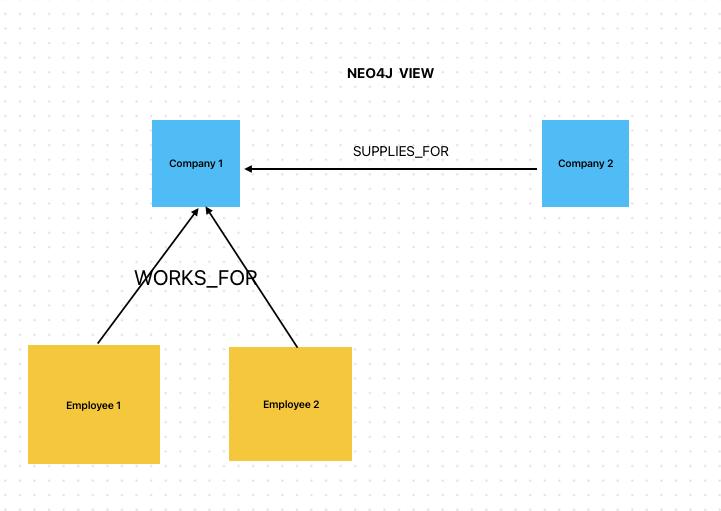
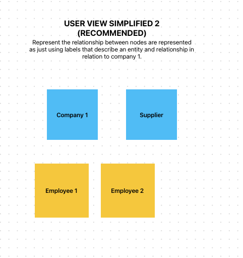

# Node data abstraction

This project aims at showing how to represent nodes from a Neo4j database in a simplified, user friendly manner.

## Getting Started

To run the app, execute the following command:

```bash
npm install
npm run dev
```

## Problem Statement

User data is stored in a Neo4j database that represents data as nodes and edges (relationships). However, presenting this data to the user as is, will look messy as the database gets large.

Hence the question; How do we present this data in a way that users can easily understand - abstracting the complexity of several nodes and edges.

## Considerations

- We need to eliminate the need for connector labels in the UI, so that the db relationships between nodes are inferred.
- We need to represent the UI state (positions, types, and connections) of the UI nodes in the database.
- The user diagram should directly be translated to content on the database.

## Implementation Plan

The UI will provide entitites which can be dragged and dropped on the canvas as nodes. These entities are also to be connected using unlabelled connectors representing edges in the db. The system will infer the relationship between connected entities and store them in the database.


## Images

Database View



Recommended User View (Edit to add edges)



# Inferring relationship between nodes

Entities provided on the UI should be given a name that can infer its relationship to other entities its connected to. For example, if a supplier is connected to a company, we can infer the db relationship as SUPPLIES. 

Example 1:
Consider a company (called Company B) that supplies another company (called Company A) with raw materials.
In the UI, Company B can be represented using the SUPPLIER entity, which is connected to COMPANY (Company A). We can then infer the db relationship as SUPPLIES.

We can represent the data in the database as:
if (:COMPANY {name: "B"})-[:SUPPLIES]->(:COMPANY {name: "A"})

Example 2:
Consider employee 1 and employee 2 who both work for Company A.
In the UI, Employee 1 and Employee 2 can be represented using the EMPLOYEE entity, which is connected to COMPANY (Company A). We can then infer the db relationship as WORKS_FOR.

We can represent the data in the database as:
if (:EMPLOYEE {name: "Employee 1"})-[:WORKS_FOR]->(:COMPANY {name: "A"})
if (:EMPLOYEE {name: "Employee 2"})-[:WORKS_FOR]->(:COMPANY {name: "A"})

## Saving the canvas state to the database

The complete state of the canvas can be represented in JSON in the format below.

```json 
{
  "nodes": [
    {
      "id": "node-1-uuid",
      "type": "company",
      "position": {
        "x": 250,
        "y": 100
      },
      "data": {
        "label": "Company",
        "name": "Acme Corp"
      },
      "width": 192,
      "height": 104,
      "selected": false,
      "positionAbsolute": {
        "x": 250,
        "y": 100
      }
    },
    {
      "id": "node-2-uuid",
      "type": "employee",
      "position": {
        "x": 600,
        "y": 250
      },
      "data": {
        "label": "Employee",
        "name": "Jane Doe"
      },
      "width": 192,
      "height": 104,
      "selected": false,
      "positionAbsolute": {
        "x": 600,
        "y": 250
      }
    }
  ],
  "edges": [
    {
      "id": "edge-1-2-uuid",
      "source": "node-1-uuid",
      "sourceHandle": "reactflow__handle-source-right",
      "target": "node-2-uuid",
      "targetHandle": "reactflow__handle-target-left",
      "type": "customEdge",
      "animated": true
    }
  ]
}
```

## Representing UI Nodes on the database. (STILL IN REVIEW)

Review question: How do we store the state of the canvas

Possible Solutions:
1. Directly represent the state of the canvas in the database. Neo4j nodes holding entities (and their UI information), and edges holding connector UI information.

2. Create an alternate database that stores the state of the canvas as is. A collection based non-relational database (like MongoDB) can be used to store the state of the canvas.

### Approach 1: Representing Canvas state in a non-relational database.

Using this approach, the canvas state is stored in the database as is. This allows the state of the canvas to exist in a structure that is different from the Neo4j database. Allowing for deeper abstractions of the data.

The state of the canvas in this approach will serve as a template through which the Neo4j database is created.

### Approach 2: Representing Canvas state in Neo4j database.

#### Neo4j APOC format analysis.

In order to represent the canvas state in the Neo4j database, we need to understand the APOC format. The Neo4j database uses this format to show the nodes and relationships in the database in JSON format.
Consider a database that has the following nodes, Company A, Company B, Employee 1 and Employee 2.

The following cypher queries can be used to query the database for its nodes and relationships.

```cypher
MATCH (n)
OPTIONAL MATCH (n)-[r]->(m)
RETURN n, r, m
```

```cypher
CALL apoc.export.json.all("graph.json", {})
```

The result displayed using the Neo4j APOC format thus:

```json
{
  "nodes": [
    {
      "id": "1",
      "labels": ["Company"],
      "properties": {
        "name": "Company A"
      }
    },
    {
      "id": "2",
      "labels": ["Company"],
      "properties": {
        "name": "Company B"
      }
    },
    {
      "id": "3",
      "labels": ["Employee"],
      "properties": {
        "name": "Employee 1"
      }
    },
    {
      "id": "4",
      "labels": ["Employee"],
      "properties": {
        "name": "Employee 2"
      }
    }
  ],
  "relationships": [
    {
      "id": "10",
      "type": "SUPPLIES_FOR",
      "start": "2",
      "end": "1",
      "properties": {}
    },
    {
      "id": "11",
      "type": "WORKS_FOR",
      "start": "3",
      "end": "1",
      "properties": {}
    },
    {
      "id": "12",
      "type": "WORKS_FOR",
      "start": "4",
      "end": "1",
      "properties": {}
    }
  ]
}
```

#### Storing Canvas state in Neo4j (Approach 2)

We can attach the UI positions as properties of the nodes in the database. We can also add connector properties to the edges.

```json
{
  "nodes": [
    {
      "id": "1",
      "labels": ["Company"],
      "properties": {
        "name": "Company A",
        "positionAbsolute": {
          "x": 100,
          "y": 100
        },
        "width": 192,
        "height": 104,
        "selected": false,
      }
    }
  ],
  "relationships": [
    {
      "id": "10",
      "type": "SUPPLIES_FOR",
      "start": "2",
      "end": "1",
      "properties": {
        "ui_id": "edge-1-2-uuid",
        "source": "node-1-uuid",
        "sourceHandle": "reactflow__handle-source-right",
        "target": "node-2-uuid",
        "targetHandle": "reactflow__handle-target-left"
      }
    }
  ]
}
```

#### Cons of Approach 2

If the approach is used, the canvass will be a one-to-one representation of the Neo4j database. This will result in less abstraction, resulting in a very cluttered canvas.
Hence, this approach should only be used when the Neo4j database is small.

